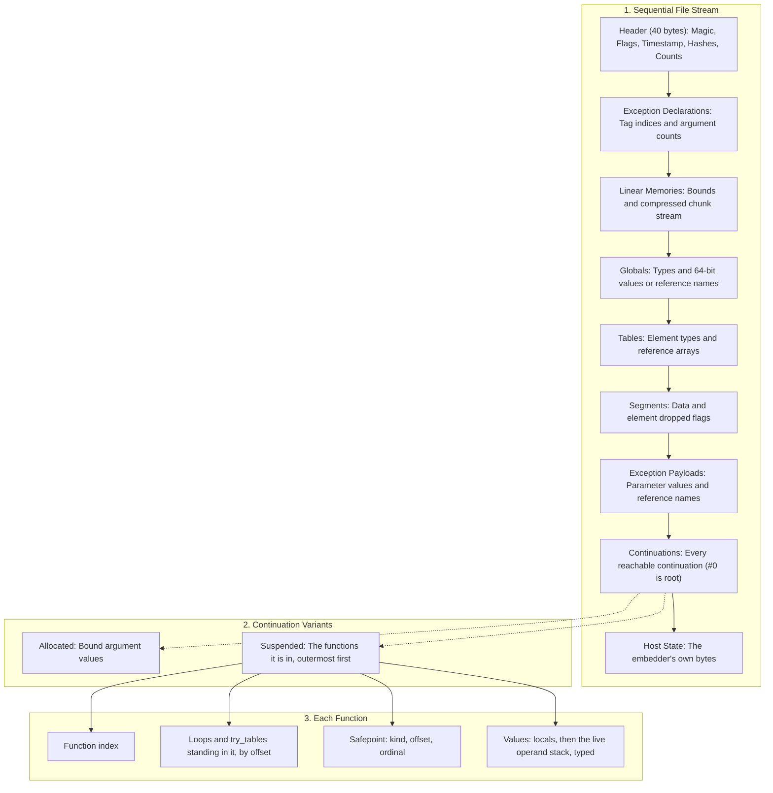

# W3S snapshot file format

A `.w3s` file stores the execution state of a suspended Wasm3 runtime: linear
memories, globals, tables, dropped segment states, the paused call stack with all
reachable continuations and exceptions, and whatever state the embedder chose to
carry along.

The file is written in WebAssembly's terms, not in those of the build that wrote it.
Every number is little endian. A place in a function is a byte offset into its Wasm
body. A suspended function is its locals and live operand stack, as typed values in
Wasm order. Nothing in it is an address, an interpreter slot or a metacode word, so a
snapshot resumes in a build of another architecture, byte order, pointer or slot
width, compiler or operating system, with gas metering on or off.

The reference implementation for parsing and manipulating `.w3s` files outside the
engine is [`extra/w3s-tool.py`](../extra/w3s-tool.py).

---

## Scope and representable state

A snapshot covers one module: the entry module of the paused call, with its linear
memories (including each one's page size), its globals and tables, and which of its
data and element segments have been dropped.

The paused call is saved whole, including everything it can still reach through
stack switching:

- the call's own functions, and the continuation of every `resume` it is waiting in,
  with that continuation's functions in turn
- every continuation held in a local, a global or a table, whether it has not
  started yet, holds bound arguments, or is suspended with functions of its own
- every exception held as an `exnref`, or waiting to be raised by `resume_throw`

A reference is written as the thing it names rather than as an address: a `funcref` as
a function index, a `contref` or an `exnref` as the continuation or exception the file
carries, and an `externref` as a number the embedder chose (see
[State outside the file](#state-outside-the-file)). Restoring rebuilds all of them.

Saving is refused, rather than writing something that cannot be restored, when the
program holds a reference the file cannot name:

- a non-null `externref`, unless the embedder has a hook to name it
- a `funcref`, continuation or suspended frame from another module
- an `exnref` whose exception no longer exists
- a `v128` value, which Wasm3 does not execute

### Where a function can stand

A function in a suspended continuation is always stopped at a **safepoint**, one of
the places the compiler records while a runtime is suspendable:

| Kind | Name | Where |
|---|---|---|
| `0` | back edge | a branch back to a loop, which is where a suspend the host asked for takes effect |
| `1` | suspend | just past a `suspend` or a `switch` |
| `2` | call | a call waiting on its callee |
| `3` | resume | a `resume` waiting on the continuation it runs |
| `4` | gas charge | the start of a gas segment, where running out of gas stops a metered runtime |

A safepoint is identified by its kind, the offset of the instruction it belongs to,
and an **ordinal**: how many safepoints of the same kind that instruction has before
it. One `br_table` can branch back to several loops, and so has several back edges.

A runtime that is not metering records a gas charge safepoint wherever a metering one
would charge, without emitting the charge. That is what lets a snapshot taken when the
gas ran out resume in a runtime with no gas limit.

### State outside the file

The embedder decides what else comes across, through `m3_SetSnapshotHooks`:

- `nameExternRef` / `bindExternRef` turn an `externref` into a 64-bit name and back.
  `0xFFFFFFFFFFFFFFFF` is not a name; it is the null reference.
- `saveHostState` / `loadHostState` carry a block of the embedder's own bytes after the
  program's state: open files and their positions, clocks, random state, anything the
  module's imports keep.

Without hooks, nothing outside the Wasm state is saved. The Wasm3 CLI sets none.

---

## File layout overview

A W3S file is a fixed 40-byte header followed by sequential sections, the list of
continuations and the host state. The paused invocation is the root continuation
(index 0).



---

## Constants and types

### Magic and versions

| Name | Value | Description |
|---|---|---|
| `c_snapshotMagic` | `0x57 0x33 0x53 0x01` | ASCII `"W3S"` followed by `0x01` (format version 1) |
| `d_m3SnapshotNone` | `0xFFFFFFFF` | An absent index (`UINT32_MAX`) |
| `d_m3SnapshotNullRef` | `0xFFFFFFFFFFFFFFFF` | A null reference (`UINT64_MAX`) |

### Flags

| Bit | Name | Description |
|---|---|---|
| `0x01` | `d_m3SnapshotFlagPostmortem` | Written on trap / `--dump-on-trap`. Non-resumable state dump. |

### Value types

| Value | Type |
|---|---|
| `1` | `i32` |
| `2` | `i64` |
| `3` | `f32` |
| `4` | `f64` |
| `6` | `funcref` |
| `7` | `externref` |
| `8` | `exnref` |
| `9` | `contref` |

A value is written as a `u64` word: a 32-bit number zero-extended, a float as its bit
pattern, a reference as its name or `d_m3SnapshotNullRef`. Typed references are
written as the base type above.

### Memory chunk kinds

| Byte | Name | Description |
|---|---|---|
| `0x00` | `d_m3ChunkEnd` | Terminates the chunk stream for a memory |
| `0x01` | `d_m3ChunkRaw` | Followed by offset, length, and raw bytes |
| `0x02` | `d_m3ChunkFillFF` | Followed by offset and length of repeated `0xFF` bytes |

Runs of `0x00` of at least `d_m3SnapshotRunThreshold` bytes (128 by default) are
omitted entirely; the restorer pre-zeroes the memory. Linear memory is little endian
on every host, so its bytes are written as they are.

### Continuation states

| Value | Name | Description |
|---|---|---|
| `0` | `snapshot_contAllocated` | Created and possibly holding bound arguments, not yet started |
| `1` | `snapshot_contSuspended` | Paused, in the middle of the functions listed with it |
| `2` | `snapshot_contFinished` | Returned, consumed, or terminated |

### Block kinds

| Value | Name | Description |
|---|---|---|
| `1` | `snapshot_blockLoop` | A `loop` whose body is running |
| `2` | `snapshot_blockTry` | A `try_table` whose body is running, or has run and not yet been left behind |

---

## Detailed binary structure

### 1. Header (40 bytes)

| Offset | Field | Type | Description |
|---|---|---|---|
| 0 | `magic` | `u8[4]` | ASCII `"W3S\x01"` |
| 4 | `flags` | `u32` | `0x1` = postmortem dump; `0x0` = resumable |
| 8 | `timestamp_ms` | `u64` | When the snapshot was taken, in milliseconds since the Unix epoch, UTC. `0` on a system with no clock |
| 16 | `wasm3_hash` | `u64` | FNV-1a hash of the Wasm3 version string and the WebAssembly features the build implements |
| 24 | `module_hash` | `u64` | FNV-1a hash of the module's raw WebAssembly bytecode |
| 32 | `num_continuations` | `u32` | Total number of continuations stored. Index 0 is the root |
| 36 | `num_exceptions` | `u32` | Total number of exceptions stored |

### 2. Exception declarations

For each exception ($0 \le i < \text{num\_exceptions}$):

| Field | Type | Description |
|---|---|---|
| `tag_index` | `u32` | Index of the exception tag in the module |
| `num_args` | `u32` | Number of payload parameters defined for this tag |

### 3. Memories section

| Field | Type | Description |
|---|---|---|
| `num_memories` | `u32` | Number of memories defined in module |

For each memory:

| Field | Type | Description |
|---|---|---|
| `num_pages` | `u64` | Current size in pages |
| `max_pages` | `u64` | Maximum allowable pages |
| `page_size` | `u32` | Page size in bytes (typically 65,536) |
| `has_data` | `u8` | `1` if the memory is allocated, `0` if empty |

If `has_data == 1`, chunk records follow until `d_m3ChunkEnd`:

- **Raw chunk (`0x01`)**: `offset` `u32`, `length` `u32`, then `length` bytes
- **Fill-FF chunk (`0x02`)**: `offset` `u32`, `length` `u32`
- **End chunk (`0x00`)**

### 4. Globals section

| Field | Type | Description |
|---|---|---|
| `num_globals` | `u32` | Number of module globals |

For each global: `type` `u8`, then `value` `u64` (see [Value types](#value-types)).

### 5. Tables section

| Field | Type | Description |
|---|---|---|
| `num_tables` | `u32` | Number of tables in module |

For each table: `type` `u8` (the element type), `size` `u32`, then `size` reference
words `u64`.

### 6. Segments section

| Field | Type | Description |
|---|---|---|
| `num_data_segments` | `u32` | Number of data segments |
| `data_dropped` | `u8[num_data_segments]` | `1` if dropped via `data.drop` |
| `num_element_segments` | `u32` | Number of element segments |
| `elem_dropped` | `u8[num_element_segments]` | `1` if dropped via `elem.drop` |

### 7. Exception payloads

For each declared exception: `num_args` value words `u64`, typed by the tag's
parameters.

### 8. Continuations section

For each continuation ($0 \le i < \text{num\_continuations}$):

#### Continuation header

| Field | Type | Description |
|---|---|---|
| `state` | `u8` | `0` = allocated, `1` = suspended, `2` = finished |
| `is_root` | `u8` | `1` for the root invocation, which runs on the runtime's own stack |
| `type_index` | `u32` | Module type index of the continuation type, or `0xFFFFFFFF` for the root |
| `entry_func_index` | `u32` | Function the continuation was started with, or `0xFFFFFFFF` |
| `bound_args_count` | `u32` | Number of arguments bound by `cont.bind` |
| `resume_throw` | `u64` | Exception to raise when resumed, from `resume_throw`, or `0xFFFFFFFFFFFFFFFF` |

In a postmortem, the continuation ends here.

#### Bound arguments (state `0`)

`bound_args_count` value words `u64`, typed by the continuation type's parameters.

#### Suspended body (state `1`)

| Field | Type | Description |
|---|---|---|
| `num_functions` | `u32` | How many functions the continuation is in the middle of |

Each function follows, outermost first. Every one but the innermost is waiting at a
call, on the function after it. The innermost is stopped at a back edge, a gas charge
or a suspend - or waiting at a resume, in which case the rest of the suspension belongs
to the continuation that resume runs.

| Field | Type | Description |
|---|---|---|
| `func_index` | `u32` | The function. The outermost is always `entry_func_index` |
| `num_blocks` | `u32` | Loops and try_tables standing in it |

For each block, outermost first:

| Field | Type | Description |
|---|---|---|
| `kind` | `u8` | `1` = loop, `2` = try_table |
| `wasm_offset` | `u32` | Offset of the `loop` or `try_table` instruction in the function's body |
| `handlers_live` | `u8` | try_table only: `0` once its handlers were retired by leaving the block |

A block is listed while its body runs, and - since Wasm3 keeps a native frame for each
until the function returns - after control has left it too, so the list is dynamic,
not the static nesting at the safepoint.

Then the safepoint and the function's values:

| Field | Type | Description |
|---|---|---|
| `site` | `u8` | Safepoint kind (see [Where a function can stand](#where-a-function-can-stand)) |
| `wasm_offset` | `u32` | Offset of the instruction in the function's body |
| `ordinal` | `u32` | Safepoints of the same kind at the same instruction before this one |
| `num_values` | `u32` | Number of values that follow |
| `values` | `(u8 type, u64 word)[num_values]` | The function's locals, arguments first, then its live operand stack from the bottom up |
| `cont_id` | `u64` | Resume only: the continuation the resume is running |

The operand stack is what the function holds at that point in Wasm's own terms:

- at a call or a resume, it leaves out the results the operation has not written yet
- at a suspend, it includes the values the suspend is waiting for at the top, which
  `cont.bind` can already have filled in
- at a back edge, it is what was live before the loop, followed by the loop's
  parameters as the branch has just passed them

Offsets are counted from the first byte of the function's body in the code section:
the byte after the body's size, where its local declarations begin. Add the body's
position in the module to compare with `wasm-objdump -d`.

### 9. Host state

| Field | Type | Description |
|---|---|---|
| `host_state_size` | `u64` | Size of what the embedder's `saveHostState` wrote, `0` if nothing |
| `host_state` | `u8[host_state_size]` | Opaque to Wasm3 |

---

## Loading a snapshot

A snapshot is restored into the same module, run by a Wasm3 build of the same release
with the same WebAssembly features. `wasm3_hash` and `module_hash` say which, and a
mismatch is refused. Nothing else about the build has to agree.

Restoring compiles every function the snapshot names, finds each safepoint in the new
code by its kind, offset and ordinal, and checks that it holds the same number of
values of the same types. Each value then goes into whatever slot or register the new
build keeps it in there, and the native frames the interpreter needs - call, loop,
try_table, resume, and the entry frame some builds keep - are rebuilt from the new
build's own code. A snapshot that does not match what the build compiles is refused.

Loading also refuses a postmortem file, a stack that does not fit the runtime's, any
function the snapshot names that was compiled before the runtime was made suspendable,
an `externref` without a `bindExternRef` hook, and host state without a
`loadHostState` hook.

## Postmortem dumps

A file carrying `d_m3SnapshotFlagPostmortem` records memories, globals and tables for
inspection, and which continuations and exceptions they reference, but it stops each
continuation after its header and cannot be resumed. Wasm3 writes one when a trap is
dumped, or when a snapshot is taken of a runtime with no paused invocation.

---

## Diagnostic and tool interaction

[`extra/w3s-tool.py`](../extra/w3s-tool.py) reads and writes the format without Wasm3:

```sh
# Header, continuations and where each function stands, memories and globals.
# --wasm names functions, tells locals from the operand stack and gives module
# offsets; -v lists every value
extra/w3s-tool.py --wasm state.wasm info -v state.w3s

# Validate structural integrity, and that it packs back into the same bytes
extra/w3s-tool.py verify state.w3s

# Unpack snapshot into a human-readable manifest (JSON) and raw binary streams
extra/w3s-tool.py unpack state.w3s -o dump_dir/

# Repack an unpacked directory back into an identical .w3s binary
extra/w3s-tool.py pack dump_dir/ -o state_repacked.w3s

# Compare two snapshots and report state differences
extra/w3s-tool.py diff before.w3s after.w3s
```
