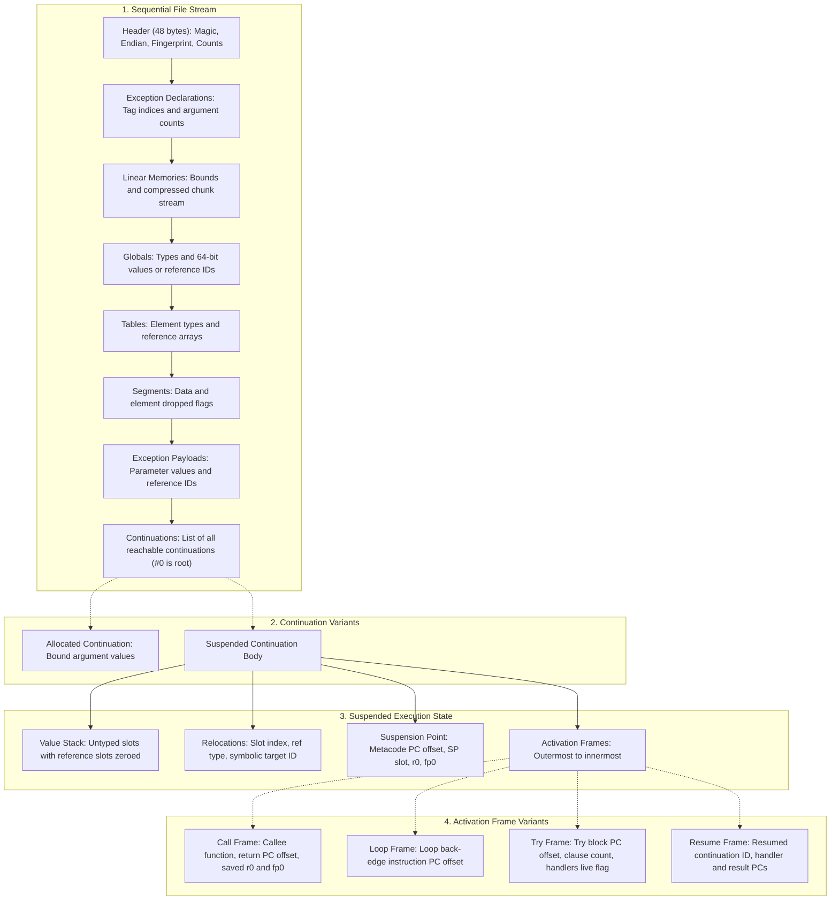

# W3S snapshot file format

A `.w3s` file stores the execution state of a suspended Wasm3 runtime: linear
memories, globals, tables, dropped segment states, and the paused call stack with
all reachable continuations and exceptions.

The format is self-describing and expressed in the host build's terms (byte
order, pointer and slot widths, compiled metacode word counts). It never writes
host memory addresses: references are represented as symbolic IDs or table
indices, and values on the runtime stack are decoupled from memory pointers via
relocation records.

The reference implementation for parsing and manipulating `.w3s` files outside the
engine is [`extra/w3s-tool.py`](../extra/w3s-tool.py).

---

## Scope and representable state

A snapshot covers one module: the entry module of the paused call, with its linear
memories (including each one's page size), its globals and tables, and which of its
data and element segments have been dropped.

The paused call is saved whole, including everything it can still reach through
stack switching:

- the call's own frames, and the continuation of every `resume` it is waiting in,
  with that continuation's frames in turn
- every continuation held in a local, a global or a table, whether it has not
  started yet, holds bound arguments, or is suspended with frames of its own
- every exception held as an `exnref`, or waiting to be raised by `resume_throw`

The value stack is untyped, so while a runtime is suspendable the compiler also
records, at every point execution can pause, which slots hold references there. The
file uses that to write each reference as the thing it names rather than as an
address: a `funcref` as a function index, a `contref` or an `exnref` as the
continuation or exception the file carries. Restoring rebuilds all of them.

Saving is refused, rather than writing something that cannot be restored, when the
program holds a reference the file cannot name:

- a non-null `externref`, which belongs to the host
- a `funcref`, continuation or suspended frame from another module
- an `exnref` whose exception no longer exists

### State outside the file

Host state is not saved: open files and their positions, sockets, runtime userdata,
WASI arguments and environment, and deterministic clock and random state must be
arranged by the embedder. The format suits single-module computations without live
host references.

---

## File layout overview

A W3S file consists of a fixed 48-byte header followed by sequential global
runtime sections, exception payloads, and a list of continuations. The paused
invocation is saved as the root continuation (index 0), whose frames and
relocations reconstruct the call tree and stack values:



All multi-byte integers are encoded in host byte order as specified by the
header's byte order marker.

---

## Constants and types

### Magic and versions

| Name | Value | Description |
|---|---|---|
| `c_snapshotMagic` | `0x57 0x33 0x53 0x01` | ASCII `"W3S"` followed by `0x01` (format version 1) |
| `d_m3SnapshotByteOrder` | `0x0102` | Endianness test word |
| `d_m3SnapshotNone` | `0xFFFFFFFF` | Represents `NULL`, unassigned, or absent index (`UINT32_MAX`) |
| `d_m3SnapshotNullRef` | `0xFFFFFFFFFFFFFFFF` | Represents a null reference (`UINT64_MAX`) |

### Flags

| Bit | Name | Description |
|---|---|---|
| `0x01` | `d_m3SnapshotFlagPostmortem` | Written on trap / `--dump-on-trap`. Non-resumable state dump. |

### Memory chunk kinds

| Byte | Name | Description |
|---|---|---|
| `0x00` | `d_m3ChunkEnd` | Terminates the chunk stream for a memory |
| `0x01` | `d_m3ChunkRaw` | Followed by offset, length, and raw bytes |
| `0x02` | `d_m3ChunkFillFF` | Followed by offset and length of repeated `0xFF` bytes |

Runs of `0x00` $\ge 64$ bytes are omitted entirely; the restorer pre-zeroes the
entire memory allocation.

### Continuation states

| Value | Name | Description |
|---|---|---|
| `0` | `snapshot_contAllocated` | Created and has bound arguments, but not yet invoked |
| `1` | `snapshot_contSuspended` | Paused execution with saved frames and stack |
| `2` | `snapshot_contFinished` | Returned, consumed, or terminated |

### Frame kinds

| Value | Name | Description |
|---|---|---|
| `0` | `snapshot_frameCall` | Waiting at a call site for callee to return |
| `1` | `snapshot_frameLoop` | Standing inside a loop |
| `2` | `snapshot_frameTry` | Standing inside an exception handling try block |
| `3` | `snapshot_frameEntry` | Module invocation entry frame |
| `4` | `snapshot_frameResume` | Waiting at a `resume` site for continuation to yield/return |

### Safepoint kinds

| Value | Name | Description |
|---|---|---|
| `0` | `safepoint_op` | Suspended in place: loop back edge or gas exhaustion |
| `1` | `safepoint_suspend` | Suspended immediately following a `suspend` or `switch` |
| `2` | `safepoint_call` | Caller frame waiting on a callee |
| `3` | `safepoint_resume` | Caller frame waiting on a resumed continuation |

---

## Detailed binary structure

### 1. Header (48 bytes)

| Offset | Field | Type | Description |
|---|---|---|---|
| 0 | `magic` | `u8[4]` | Must be ASCII `"W3S\x01"` |
| 4 | `flags` | `u32` | `0x1` = postmortem dump; `0x0` = resumable |
| 8 | `byte_order` | `u16` | `0x0102` encoded in writing host's byte order. `[0x02, 0x01]` = LE; `[0x01, 0x02]` = BE |
| 10 | `pointer_size` | `u8` | `sizeof(void*)`: `4` or `8` |
| 11 | `slot_size` | `u8` | `sizeof(m3slot_t)`: `4` or `8` |
| 12 | `build_fingerprint` | `u64` | FNV-1a hash of version string and feature configuration |
| 20 | `gas_metered` | `u8` | `1` if gas metering was enabled on runtime, else `0` |
| 21 | _reserved_ | `u8[3]` | Reserved padding / alignment (0) |
| 24 | `module_hash` | `u64` | FNV-1a hash of the module's raw WebAssembly bytecode |
| 32 | `num_continuations` | `u32` | Total number of continuations stored. Index 0 is always root |
| 36 | `num_exceptions` | `u32` | Total number of exceptions stored |
| 40 | _reserved_ | `u8[8]` | Header alignment padding (0) |

The engine validates that `byte_order`, `pointer_size`, `slot_size`,
`build_fingerprint`, `gas_metered`, and `module_hash` match the target runtime
configuration before attempting restoration.

### 2. Exception declarations

If `num_exceptions > 0`, contains declarations for each exception ($0 \le i < \text{num\_exceptions}$):

| Field | Type | Description |
|---|---|---|
| `tag_index` | `u32` | Index of the exception tag in the module |
| `num_args` | `u32` | Number of payload parameters defined for this tag |

### 3. Memories section

| Field | Type | Description |
|---|---|---|
| `num_memories` | `u32` | Number of memories defined in module |

For each memory:

| Field | Type | Description |
|---|---|---|
| `num_pages` | `u64` | Current allocated size in pages |
| `max_pages` | `u64` | Maximum allowable pages |
| `page_size` | `u32` | Page size in bytes (typically 65,536) |
| `has_data` | `u8` | `1` if memory buffer is allocated, `0` if empty |

If `has_data == 1`, chunk records follow until `d_m3ChunkEnd` (`0x00`):

- **Raw Chunk (`0x01`)**:
  - `offset`: `u32` byte offset in linear memory
  - `length`: `u32` byte length
  - `data`: `u8[length]` raw bytes
- **Fill-FF Chunk (`0x02`)**:
  - `offset`: `u32` byte offset in linear memory
  - `length`: `u32` byte length of repeated `0xFF`
- **End Chunk (`0x00`)**:
  - Marks end of chunks for this memory.

### 4. Globals section

| Field | Type | Description |
|---|---|---|
| `num_globals` | `u32` | Number of module globals |

For each global:

| Field | Type | Description |
|---|---|---|
| `type` | `u8` | Wasm3 base type (`i32`, `i64`, `f32`, `f64`, `funcref`, `externref`, `exnref`, `contref`) |
| `value` | `u64` | 64-bit value representation: numbers raw/zero-extended; references encoded as symbolic ID or `0xFFFFFFFFFFFFFFFF` |

### 5. Tables section

| Field | Type | Description |
|---|---|---|
| `num_tables` | `u32` | Number of tables in module |

For each table:

| Field | Type | Description |
|---|---|---|
| `type` | `u8` | Base element type |
| `size` | `u32` | Current number of elements |
| `elements` | `u64[size]` | Array of reference words: function index, continuation ID, or null (`0xFFFFFFFFFFFFFFFF`) |

### 6. Segments section

| Field | Type | Description |
|---|---|---|
| `num_data_segments` | `u32` | Number of data segments |
| `data_dropped` | `u8[num_data_segments]` | `1` if dropped via `data.drop`, `0` if active |
| `num_element_segments` | `u32` | Number of element segments |
| `elem_dropped` | `u8[num_element_segments]` | `1` if dropped via `elem.drop`, `0` if active |

### 7. Exception payloads

For each declared exception ($0 \le i < \text{num\_exceptions}$):

| Field | Type | Description |
|---|---|---|
| `args` | `u64[num_args]` | Array of parameter values (numbers or reference IDs) |

### 8. Continuations section

For each continuation ($0 \le i < \text{num\_continuations}$):

#### Continuation header

| Field | Type | Description |
|---|---|---|
| `state` | `u8` | `0` = allocated, `1` = suspended, `2` = finished |
| `is_root` | `u8` | `1` if root invocation continuation (runs on runtime stack), `0` otherwise |
| `type_index` | `u32` | Module function type index, or `0xFFFFFFFF` for root |
| `entry_func_index` | `u32` | Entry function index, or `0xFFFFFFFF` |
| `bound_args_count` | `u32` | Number of pre-bound arguments |
| `resume_throw` | `u64` | Pending exception ID if suspended via `resume_throw`, else `0xFFFFFFFFFFFFFFFF` |

If postmortem dump (`flags & 0x1`), continuation serialization ends here.

#### Bound arguments (if state is `snapshot_contAllocated`)

| Field | Type | Description |
|---|---|---|
| `bound_args` | `u64[bound_args_count]` | Value words for each bound argument |

#### Suspended body (if state is `snapshot_contSuspended`)

##### Stack and relocations

| Field | Type | Description |
|---|---|---|
| `num_slots` | `u32` | Number of stack slots saved |
| `stack_bytes` | `u8[num_slots * slot_size]` | Value stack contents. Reference slots are pre-zeroed |
| `num_relocations` | `u32` | Number of reference relocations on stack |

For each relocation ($0 \le r < \text{num\_relocations}$):

| Field | Type | Description |
|---|---|---|
| `slot` | `u32` | Slot index from stack base |
| `type` | `u8` | Storage type (`funcref`, `contref`, `exnref`) |
| `target_id` | `u64` | Function index or object ID (`0xFFFFFFFFFFFFFFFF` if null) |

##### Program counter and registers

| Field | Type | Description |
|---|---|---|
| `has_own_pc` | `u8` | `1` if suspended in own function; `0` if suspended inside a resumed continuation |

If `has_own_pc == 1`:

| Field | Type | Description |
|---|---|---|
| `suspend_point` | `u8` | `safepoint_op` (0) or `safepoint_suspend` (1) |
| `function_index` | `u32` | Function index of suspended activation |
| `pc_offset` | `u32` | Count of metacode words emitted in function before suspension |
| `sp_slot` | `u32` | Slot offset of continuation's stack pointer |
| `r0_type` | `u8` | Reference type held in `r0`, or `c_m3Type_none` |
| `r0_word` | `u64` | Raw accumulator or reference ID |

Followed by floating point and suspension results:

| Field | Type | Description |
|---|---|---|
| `fp0` | `f64` | Floating-point accumulator register |
| `num_suspend_results` | `u32` | Number of result slots waiting for resume |

For each suspend result ($0 \le k < \text{num\_suspend\_results}$):

| Field | Type | Description |
|---|---|---|
| `offset` | `u32` | Slot offset where result will land |
| `is_64` | `u8` | `1` if 64-bit slot, `0` if 32-bit |

##### Activation frames

Written outermost first (reconstructed innermost first on restore):

| Field | Type | Description |
|---|---|---|
| `num_frames` | `u32` | Number of call / control frames |

For each frame:

| Field | Type | Description |
|---|---|---|
| `kind` | `u8` | Frame kind: `0`=Call, `1`=Loop, `2`=Try, `3`=Entry, `4`=Resume |
| `sp_slot` | `u32` | Stack slot index of frame base |
| `memory_index` | `u32` | Associated memory index, or `0xFFFFFFFF` |
| `func_index` | `u32` | Function the frame executes |

Additional kind-specific payload:

- **`snapshot_frameCall` (0)**:
  - `pc_offset`: `u32` return address offset in caller
  - `callee_func_index`: `u32` function called
  - `r0_type`: `u8` type in saved call register
  - `r0_word`: `u64` saved register value or reference ID
  - `fp0`: `f64` saved floating point register
- **`snapshot_frameLoop` (1)**:
  - `pc_offset`: `u32` loop instruction offset
- **`snapshot_frameTry` (2)**:
  - `pc_offset`: `u32` try block instruction offset
  - `num_clauses`: `u32` number of catch clauses
  - `handlers_live`: `u8` whether handlers are active
- **`snapshot_frameEntry` (3)**:
  - `entry_func_index`: `u32` entry function
- **`snapshot_frameResume` (4)**:
  - `pc_offset`: `u32` resume instruction offset
  - `cont_id`: `u64` continuation ID being resumed
  - `handlers_pc_offset`: `u32` offset to handler metacode
  - `num_handlers`: `u32` count of resume handlers
  - `results_pc_offset`: `u32` offset to result handler metacode
  - `num_results`: `u32` count of expected continuation results

---

## Loading a snapshot

A snapshot is restored into the same module, run by the same Wasm3 build with the
same compilation settings, on a runtime whose stack is at least as large as the
original. It counts every program counter in the compiled code's own instructions
and keeps the value stack in the build's slot layout, so it is not a compatibility
format across versions and architectures.

`build_fingerprint` covers the Wasm3 version, the slot and pointer widths, and the
feature flags that change compiled code; `gas_metered` is checked alongside it
because gas instrumentation changes the compiled code too. A modified build that
keeps all of those is not detected.

Loading also refuses a postmortem file, and any function the snapshot names that
was compiled before the runtime was made suspendable.

## Postmortem dumps

A file carrying `d_m3SnapshotFlagPostmortem` records memories, globals and tables
for inspection, and which continuations and exceptions they reference, but it stops
each continuation after its header and cannot be resumed. Wasm3 writes one when a
trap is dumped, or when a snapshot is taken of a runtime with no paused invocation.

---

## Diagnostic and tool interaction

[`extra/w3s-tool.py`](../extra/w3s-tool.py) interacts with the file format:

```sh
# Display header, continuations, memory chunks, and globals summary
extra/w3s-tool.py info state.w3s

# Validate structural integrity, bounds, and chunk encodings
extra/w3s-tool.py verify state.w3s

# Unpack snapshot into a human-readable manifest (JSON) and raw binary streams
extra/w3s-tool.py unpack state.w3s -o dump_dir/

# Repack an unpacked directory back into an identical .w3s binary
extra/w3s-tool.py pack dump_dir/ -o state_repacked.w3s

# Compare two snapshots and report state differences
extra/w3s-tool.py diff before.w3s after.w3s
```
