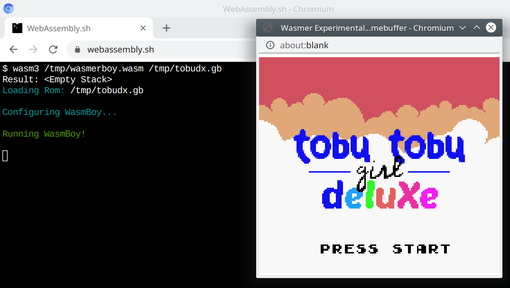

# WasmBoy

<p align="center"></p>

To run WasmBoy, you need a Gameboy ROM file. For example, you can download [`tobudx.gb` (Tobu Tobu Girl ROM)](https://tangramgames.itch.io/tobu-tobu-girl-deluxe/purchase?popup=1)

`wasm3.wasm` is a normal WASI build of Wasm3.

### Run with Webassembly.sh

Drag'n'drop `wasm3.wasm`, `wasmerboy.wasm`, `tobudx.gb` to [Webassembly.sh](https://webassembly.sh) and run:

```sh
wasm3 /tmp/wasmerboy.wasm /tmp/tobudx.gb
```

To speed it up (at your own risk, this disables security features):
```sh
chromium-browser --no-sandbox --js-flags="--wasm-opt --wasm-no-bounds-checks --wasm-no-stack-checks" "https://webassembly.sh"
```

### Run with Wasmer

```sh
mkdir fs
cp wasmerboy.wasm tobudx.gb ./fs
wasmer run --dir=fs --enable-experimental-io-devices wasm3.wasm -- fs/wasmerboy.wasm fs/tobudx.gb
```

### Also

Check out [Aaron Turner's article on Wasmer and WasmBoy](https://medium.com/wasmer/wasmer-io-devices-announcement-6f2a6fe23081).
